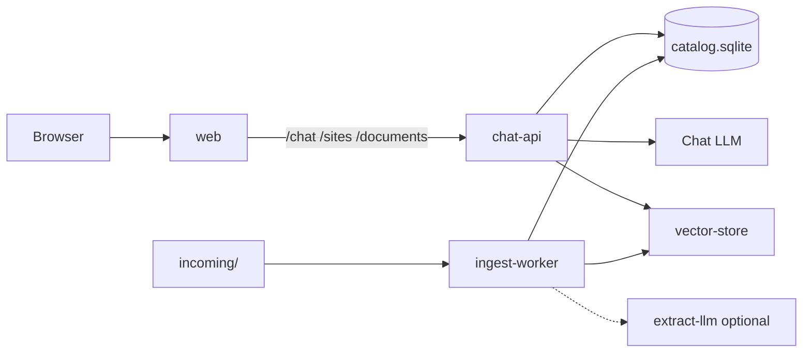
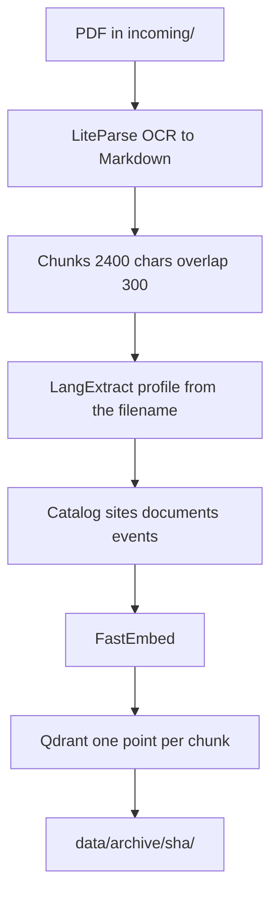
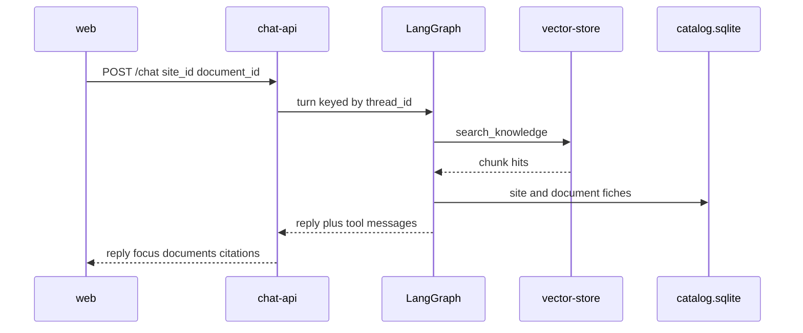

# Enviro-RAG

Local RAG for Quebec environmental site assessments (ÉES / ESA). A PDF dropped in `incoming/` is parsed, chunked, and indexed. The web UI shows one map pin per site, a chronology of that site, and a chat that searches the indexed chunks.

The model never sees the corpus in its system prompt. At ingest, LangExtract writes a business catalog. At question time, the agent calls `search_knowledge`, which reads Qdrant and the catalog.

## What it stores

| Store | Where | What |
|---|---|---|
| Chunk index | Qdrant collection `chunks` (`vector-store`, port 6333) | One point per chunk: embedded Markdown plus payload (`document_id`, `page`, `site_id`, `project_id`, `contaminants`, …) |
| Catalog | `data/catalog.sqlite` | `sites`, `documents`, `events`. Source of the map and the chronology |
| Chat memory | `data/chat_checkpoints.sqlite` | LangGraph thread history, keyed by `thread_id`. Not the corpus |
| Ingest journal | `data/documents/{sha256}.json` | One fiche per PDF (counts, paths, copy of the catalog fields). The UI does not read these files |
| Parsed text | `data/parsed/{sha256}.md` | Markdown the chunks and LangExtract share |
| Extractions | `data/extractions/{sha256}.jsonl` and `.html` | Raw LangExtract output |
| Ingest log | `data/log_ingest.jsonl` | One JSON line per ingest attempt |

`document_id` is the SHA-256 of the PDF. `site_id` is `lot:{cadastral number}` when a lot is known, otherwise an address key. Two reports on the same lot share one site.

## Runtime

Everything in Compose joins the Docker network **`enviro-rag`**. REST paths stay `/chat`, `/sites`, `/documents`, and `/health`. Only the service DNS names changed.

| Service | Container | Role | Port |
|---|---|---|---|
| `web` | `enviro-rag-web` | nginx: static UI, reverse-proxy to the API | 3000 → 80 |
| `chat-api` | `enviro-rag-chat-api` | `rag-chat serve` — FastAPI chat and catalog reads | 8000 |
| `ingest-worker` | `enviro-rag-ingest-worker` | `rag-ingest watch` — PDFs in `incoming/` | — |
| `vector-store` | `enviro-rag-vector-store` | Qdrant v1.19 | 6333 |
| `extract-llm` | `enviro-rag-extract-llm` | Optional Ollama. Profile `extract` only | 11434 |

`chat-api` and `ingest-worker` share the image `rag-ingestion:local`. Embeddings (FastEmbed) are inside that image. The chat LLM is not: set `LLM_PROVIDER` to `local` (llama-server), `ollama`, `openai`, or `gemini`. For the optional in-network model, `docker compose --profile extract up -d` and `OLLAMA_BASE_URL=http://extract-llm:11434`.



Host ports: UI `http://localhost:3000`, API `http://localhost:8000`, Qdrant `http://localhost:6333`.

## Ingest



1. **Parse** (`parse.py`). LiteParse writes one Markdown string. Page offsets in that string are the coordinate system for chunks and extractions. Empty Markdown skips the file.
2. **Chunk** (`chunk.py`). Windows of `CHUNK_SIZE_CHARS` (2400) with overlap 300, snapped to paragraphs and tables. `chunk_id` is `{document_id}:{index}`.
3. **Extract** (`extract.py`, `extract_profile.py`). The PDF name picks a profile in `config/langextract/profiles.json` (`ees_phase_1`, `ees_phase_2`, or `default`). LangExtract runs on the full Markdown.
4. **Catalog** (`document_meta.py`, `catalog.py`). Project, title, firm, client, lot, address, contaminants, and typed dates (`contract`, `fieldwork`, `report`, lab and access-to-information roles) are written to SQLite. A lot polygon comes from the Quebec cadastre (`cadastre.py`); Nominatim fills lat/lon only as a fallback (`geocode.py`).
5. **Align** (`align.py`). Local labels attach to a chunk only when the extraction span overlaps it. `doc_type`, `project_id`, and `contaminants` are copied onto every chunk of the document.
6. **Embed and upsert** (`embed.py`, `qdrant_store.py`). The vector is the chunk text only. Re-ingest deletes that `document_id` first, then upserts. Same SHA still present in `data/archive/` is not ingested again. Failures go to `data/failed/`.

Triggers: drop a file in `incoming/` (`ingest-worker`), `rag-ingest ingest file.pdf`, or `rag-ingest watch --once`.

## Ask

`POST /chat` takes `message`, `thread_id`, `site_id`, and `document_id`. The UI sends the selected pin as `site_id`. A chronology click sends that report as `document_id` (the document filter wins). Those ids are applied inside `search_knowledge` even if the model omits them.



`focus`, `documents`, and `citations` come from the tool messages of that turn (`focus.py`), not from the generated text. If the question contains a cadastral lot number, `search_knowledge` resolves `site_id=lot:…` from SQLite before calling Qdrant.

Checkpoints keep the full thread. Each model call only receives a trimmed tail (`graph.py`) so the prompt stays inside the context window.

## Interface

The screen is a 65/35 split: map on the left, chat on the right. Nothing is selected on load. The map opens on southern Quebec around Montreal (about 45.55°N, 73.4°W, zoom 8). The site card floats at the top right of the map. Its metadata (lot, address, phase, client, files, contaminants) stays visible once a pin is chosen. **Chronologie** folds the dated events open or closed.

1. **Map** — `GET /sites`. One pin at the lot centroid, polygon when the cadastre returned one. Clicking a pin selects the site, frames the lot, and loads each PDF into the context bar (`@filename`). The chat input stays empty.
2. **Chronology** — `GET /sites/{site_id}/timeline`, inside the map card. The header (phase I/II, client, filenames, contaminants) is the `documents` rows for that site, shown once. Phase comes from `doc_type`, or from the filename then the title when that field is empty. Each row below is an `events` row, grouped by `iso_date`, newest first. Clicking a date adds a second chip: the date and the roles of that day (for example `2025-08-08 Analyse laboratoire`).
3. **Chat** — `POST /chat`, the right 35%. The context bar sits above the input. Each chip has its own cross. The typed question is what the transcript shows. The API prefixes the same chip labels onto the prompt (`context`), and sends `document_id` when a single loaded file, or the chronology section's file, is still in the bar. `site_id` follows the selected pin. Replies render Markdown and LaTeX. Citations are grouped: the filename once, then the page numbers.

Map tiles are Leaflet / OpenStreetMap. No tile API key.

## File layout

```
.
├── README.md                how to run
├── docker-compose.yml       network enviro-rag
├── Dockerfile               image rag-ingestion:local (ingest + chat)
├── pyproject.toml           package rag-ingestion, scripts rag-ingest and rag-chat
├── .env.example
├── incoming/                drop folder for PDFs
├── data/                    catalog, checkpoints, archive, parsed, extractions, journals
├── config/
│   ├── langextract/         extraction prompt, profiles, few-shots
│   └── chatbot/             chat prompt and settings.json
├── docker/
│   ├── entrypoint.sh        wait until vector-store answers
│   └── prefetch_embed.py    download FastEmbed weights at image build
├── docs/
│   ├── OVERVIEW.md          this document
│   ├── INGESTION.md         ingest pipeline, field by field
│   └── API.md               HTTP API and UI contract
├── src/rag_ingestion/       ingest, catalog, retrieval
├── src/chatbot/             LangGraph agent and HTTP API
├── tests/                   pytest
└── ui/                      React map, chronology, chat
```

### `src/rag_ingestion/`

| File | Purpose |
|---|---|
| `pipeline.py` | Orchestrates one PDF: parse, chunk, extract, catalog, embed, Qdrant |
| `cli.py` | `rag-ingest`: `ingest`, `query`, `watch` |
| `parse.py` | PDF to Markdown via LiteParse, page spans, OCR quality |
| `headers.py` | Strips repeating page banners before chunking |
| `chunk.py` | Markdown windows, `heading_path`, page assignment |
| `extract.py` | LangExtract call |
| `extract_profile.py` | Profile chosen from the PDF filename |
| `document_meta.py` | Extractions to a document fiche and typed events |
| `align.py` | Extractions onto the chunks they overlap; document-level fields copied everywhere |
| `catalog.py` | SQLite `sites` / `documents` / `events`, timeline and site reads |
| `cadastre.py` | Quebec cadastre lot polygon |
| `geocode.py` | Nominatim lat/lon when there is no lot polygon |
| `normalize.py` | Lots, addresses, dates, timeline roles, project tokens |
| `embed.py` | FastEmbed |
| `qdrant_store.py` | Collection, payload indexes, delete, upsert, filtered query |
| `retrieve.py` | Hybrid search used by the CLI and by `search_knowledge` |
| `llm_providers.py` | `LLM_PROVIDER` for chat and for LangExtract |
| `inbox.py` | Drop folder: poll, archive, failed, SHA skip |
| `ingest_log.py` | Append-only `log_ingest.jsonl` |
| `config.py` | Settings from `.env` |
| `models.py` | Dataclasses shared by the pipeline |
| `logging_setup.py` | Step timer and log format |

### `src/chatbot/`

| File | Purpose |
|---|---|
| `api.py` | FastAPI: `/chat`, `/sites`, `/documents`, `/health` |
| `cli.py` | `rag-chat` REPL and `rag-chat serve` |
| `graph.py` | LangGraph ReAct agent, SQLite checkpointer, context trim |
| `tools.py` | `search_knowledge` |
| `llm.py` | Chat model (OpenAI-compatible or Gemini) |
| `focus.py` | `focus`, document fiches, and citations from tool messages |
| `config.py` | `config/chatbot/settings.json` plus env |
| `health.py` | Qdrant, SQLite, and LLM reachability |
| `timing.py` | Per-turn timings returned to the UI |
| `errors.py` | Classify LLM connection failures |

### `ui/`

| File | Purpose |
|---|---|
| `src/App.jsx` | Map, chronology, chat |
| `src/api.js` | HTTP client, French labels, timeline grouping, context-bar labels |
| `src/ChatTiming.jsx` | Expandable timing on an assistant message |
| `nginx.conf` | Proxies `/chat`, `/sites`, `/documents`, `/health` to `chat-api:8000` |
| `vite.config.js` | Dev server proxy to `127.0.0.1:8000` |
| `Dockerfile` | Static build served by nginx |

### `config/`

| Path | Purpose |
|---|---|
| `langextract/prompt.base.txt` | Shared extraction prompt |
| `langextract/profiles.json` | Filename patterns to profile id |
| `langextract/profiles/*/addendum.txt` | Profile-specific instructions |
| `langextract/profiles/*/few_shots.json` | Examples. Each `extraction_text` must appear verbatim in `text` |
| `chatbot/prompt.txt` | Agent system prompt |
| `chatbot/settings.json` | RAG limits, temperature, checkpoint path |

## Commands

```bash
cp .env.example .env
docker compose up -d --build          # web, chat-api, ingest-worker, vector-store
docker compose --profile extract up -d  # also extract-llm
```

Local development, API on the host, vectors in Compose:

```bash
docker compose up -d vector-store
pip install -e ".[dev]" && pip install -e ".[chat]"
rag-ingest ingest path/to/file.pdf
rag-chat serve
cd ui && npm install && npm run dev
```
